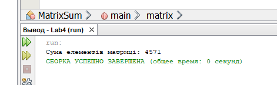
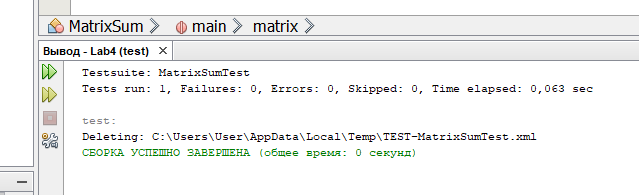
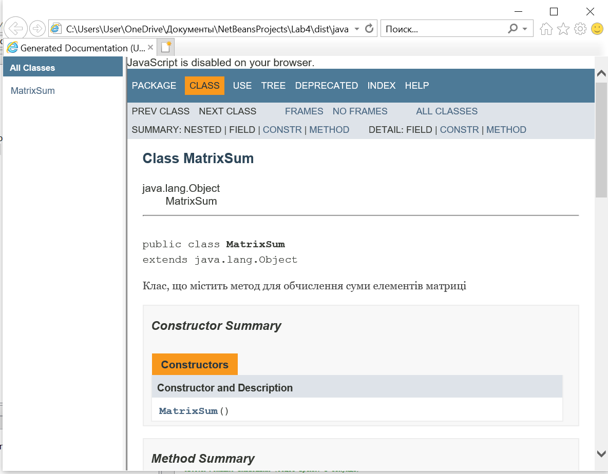

# Практична робота "Поглиблене використання масивів"

## Список завдань

5. Обчислити суму елементів матриці розміром N x M (21 за списком групи, 16 завдань, тому почав рахувати спочатку, вийшло що число 21 = 5 номеру завдання)

## Результати роботи

**1.** Створення класу [MatrixSum.java](https://github.com/ppc-ntu-khpi/34-advarrays-Chuda4ok/blob/master/src/MatrixSum.java) для обчислення суми елементів матриці розміром N x M з javadoc-документацією

 
**2.** Створення класу [MatrixSumTest.java](https://github.com/ppc-ntu-khpi/34-advarrays-Chuda4ok/blob/master/src/MatrixSumTest.java) для тестування класу [MatrixSum.java](https://github.com/ppc-ntu-khpi/34-advarrays-Chuda4ok/blob/master/src/MatrixSum.java)

**3.** Відкриття javadoc-документації у браузері 

